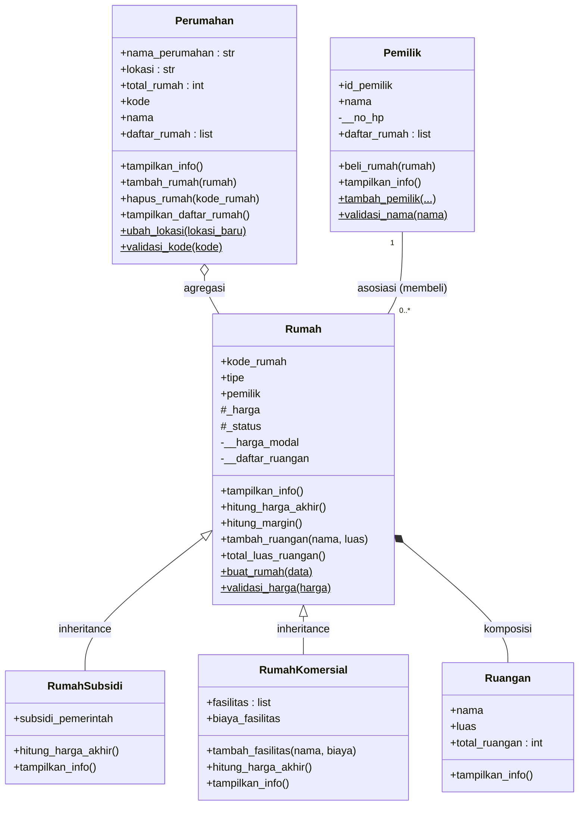

# Posttest Pemrograman Berorientasi Objek — Rae Perumahan

| | |
|---|---|
| **Nama** | _(isi nama Anda)_ |
| **NIM** | _(isi NIM Anda)_ |
| **Kelas** | _(isi kelas Anda)_ |
| **Judul Proyek** | Sistem Rae Perumahan |

---

## 1. Deskripsi Program

Program ini adalah sistem sederhana pengelolaan **perumahan**. Sistem mencatat data perumahan, rumah (beserta jenisnya), ruangan di dalam rumah, dan pemilik rumah.

Posttest ini melanjutkan program sebelumnya dengan menerapkan dua konsep:

1. **Relasi UML**: Asosiasi, Agregasi, dan Komposisi
2. **Inheritance**: Superclass, Subclass, `super()`, atribut tambahan, method overriding, serta atribut protected dan private

---

## 2. Daftar Kelas

| Kelas | Peran |
|---|---|
| `Perumahan` | Kumpulan rumah dalam satu kawasan (**agregasi** dengan `Rumah`) |
| `Rumah` | **Superclass**, berisi data umum sebuah rumah |
| `RumahSubsidi` | **Subclass** dari `Rumah`, rumah dengan potongan subsidi |
| `RumahKomersial` | **Subclass** dari `Rumah`, rumah dengan fasilitas tambahan |
| `Pemilik` | Orang yang membeli rumah (**asosiasi** dengan `Rumah`) |
| `Ruangan` | Bagian dari rumah (**komposisi** dengan `Rumah`) |

---

## 3. Diagram UML



> Keterangan visibilitas: `+` public, `#` protected, `-` private, `$` static/class method.

---

## 4. Penerapan Relasi UML

### 4.1 Asosiasi — `Pemilik` ↔ `Rumah`

**Alasan:** Pemilik membeli rumah, namun keduanya adalah objek yang **berdiri sendiri**. Pemilik tidak membuat rumah, dan rumah tidak dibuat oleh pemilik. Mereka hanya saling mengetahui satu sama lain (relasi **dua arah**).

- `Pemilik.daftar_rumah` → pemilik tahu rumah apa saja yang ia miliki
- `Rumah.pemilik` → rumah tahu siapa pemiliknya

```python
class Pemilik:
    def beli_rumah(self, rumah):
        if rumah.pemilik is not None or rumah.status != "Kosong":
            print(f"Rumah {rumah.kode_rumah} tidak tersedia untuk dibeli!")
            return False
        rumah.pemilik = self              # rumah -> pemilik
        self.daftar_rumah.append(rumah)   # pemilik -> rumah
        rumah.status = "Terisi"
        print(f"{self.nama} berhasil membeli rumah {rumah.kode_rumah}.")
        return True
```

### 4.2 Agregasi — `Perumahan` o— `Rumah`

**Alasan:** Perumahan **memiliki** banyak rumah, tetapi objek `Rumah` dibuat **di luar** `Perumahan`, lalu hanya dimasukkan ke dalam daftar. Jika rumah dikeluarkan atau perumahan dihapus, objek `Rumah` **tetap ada** dan dapat dipakai lagi, misalnya dimasukkan ke perumahan lain.

```python
class Perumahan:
    def __init__(self, kode, nama):
        self.kode = kode
        self.nama = nama
        self.daftar_rumah = []            # menampung objek dari luar

    def tambah_rumah(self, rumah):        # rumah dibuat di luar kelas ini
        self.daftar_rumah.append(rumah)

    def hapus_rumah(self, kode_rumah):    # dikeluarkan, objek tidak dihancurkan
        for rumah in self.daftar_rumah:
            if rumah.kode_rumah == kode_rumah:
                self.daftar_rumah.remove(rumah)
                return rumah
```

Bukti di program: rumah `R03` dikeluarkan dari *Rae Harmoni*, objeknya masih ada, lalu dimasukkan ke *Rae Sejahtera*.

### 4.3 Komposisi — `Rumah` ◆— `Ruangan`

**Alasan:** Ruangan **tidak bisa berdiri sendiri** tanpa rumah. Objek `Ruangan` **dibuat di dalam** `Rumah` (lewat `tambah_ruangan`), disimpan di atribut **private**, dan ikut hilang ketika `Rumah` dihapus.

```python
class Rumah:
    def __init__(self, ...):
        self.__daftar_ruangan = []        # private, hanya dikelola Rumah

    def tambah_ruangan(self, nama, luas):
        self.__daftar_ruangan.append(Ruangan(nama, luas))   # dibuat DI DALAM Rumah
```

Bukti di program: `rumah_sementara` dibuat dengan satu ruangan, lalu dihapus dengan `del`. Jumlah objek `Ruangan` turun dari 4 menjadi 3 dan ruangan tersebut tidak lagi ada di memori.

### 4.4 Ringkasan Perbedaan

| Relasi | Kelas | Siapa yang membuat objek bagian? | Jika "pemilik relasi" dihapus |
|---|---|---|---|
| Asosiasi | `Pemilik` — `Rumah` | Masing-masing dibuat sendiri | Keduanya tetap ada |
| Agregasi | `Perumahan` o— `Rumah` | Dibuat di luar `Perumahan` | `Rumah` tetap ada |
| Komposisi | `Rumah` ◆— `Ruangan` | Dibuat di dalam `Rumah` | `Ruangan` ikut hilang |

---

## 5. Penerapan Inheritance

### 5.1 Superclass dan Subclass

| Superclass | Subclass |
|---|---|
| `Rumah` | `RumahSubsidi` |
| | `RumahKomersial` |

```python
class RumahSubsidi(Rumah): ...
class RumahKomersial(Rumah): ...
```

### 5.2 Penggunaan `super().__init__(...)`

Setiap subclass memanggil konstruktor superclass agar atribut umum (`kode_rumah`, `tipe`, `harga`, dan seterusnya) tidak ditulis ulang.

```python
class RumahSubsidi(Rumah):
    def __init__(self, kode_rumah, tipe, harga, subsidi_pemerintah, harga_modal=None):
        super().__init__(kode_rumah, tipe, harga, harga_modal)
        self.subsidi_pemerintah = subsidi_pemerintah   # atribut unik

class RumahKomersial(Rumah):
    def __init__(self, kode_rumah, tipe, harga, fasilitas, biaya_fasilitas, harga_modal=None):
        super().__init__(kode_rumah, tipe, harga, harga_modal)
        self.fasilitas = fasilitas                      # atribut unik
        self.biaya_fasilitas = biaya_fasilitas          # atribut unik
```

### 5.3 Atribut Tambahan (Spesifik Subclass)

| Subclass | Atribut unik | Fungsi |
|---|---|---|
| `RumahSubsidi` | `subsidi_pemerintah` | Potongan harga dari pemerintah |
| `RumahKomersial` | `fasilitas`, `biaya_fasilitas` | Daftar dan biaya fasilitas tambahan |

### 5.4 Method Overriding

Method `hitung_harga_akhir()` dan `tampilkan_info()` pada superclass **didefinisikan ulang** di tiap subclass dengan perilaku berbeda.

```python
# Superclass
def hitung_harga_akhir(self):
    return self._harga

# RumahSubsidi  -> harga dikurangi subsidi
def hitung_harga_akhir(self):
    return self._harga - self.subsidi_pemerintah

# RumahKomersial -> harga ditambah biaya fasilitas
def hitung_harga_akhir(self):
    return self._harga + self.biaya_fasilitas
```

`tampilkan_info()` di subclass juga memanggil `super().tampilkan_info()` terlebih dahulu, lalu menambahkan informasi khusus (subsidi atau fasilitas).

**Hasil polimorfisme:** pemanggilan method yang sama menghasilkan nilai berbeda sesuai jenis objek.

```
R01 (Rumah          ) -> Harga akhir: Rp300,000,000
R04 (RumahSubsidi   ) -> Harga akhir: Rp175,000,000
R05 (RumahKomersial ) -> Harga akhir: Rp650,000,000
```

### 5.5 Tingkat Akses: Protected dan Private

| Atribut | Akses | Alasan |
|---|---|---|
| `_harga` | **Protected** | Subclass perlu membaca harga untuk menghitung harga akhir |
| `_status` | **Protected** | Data status dapat dimanipulasi subclass bila dibutuhkan |
| `__harga_modal` | **Private** | Data rahasia developer, hanya boleh diakses lewat method `hitung_margin()` |
| `__daftar_ruangan` | **Private** | Hanya `Rumah` yang berhak mengelola daftar ruangan (komposisi) |

```python
# Superclass
self._harga = harga                         # protected
self.__harga_modal = harga_modal ...        # private

# Subclass memakai protected secara langsung
return self._harga - self.subsidi_pemerintah

# Subclass TIDAK bisa mengakses private -> harus lewat method publik
rumah_subsidi.hitung_margin()
```

Percobaan mengakses atribut private dari luar menghasilkan error:

```
Akses langsung __harga_modal ditolak -> 'RumahSubsidi' object has no attribute '__harga_modal'
```

---

## 6. Cara Menjalankan

```bash
python posttest.py
```

Syarat: Python 3.x (hanya memakai modul bawaan `gc` dan `weakref`).

---

## 7. Hasil Output Program (Bagian Lanjutan)

<details>
<summary><b>Inheritance</b></summary>

```
OBJEK SUBCLASS: RUMAH SUBSIDI
--------------------------------------------------
Kode Rumah : R04
Tipe       : 36
Harga      : Rp200,000,000
Status     : Kosong
Pemilik    : -
Jenis      : Rumah Subsidi
Subsidi    : Rp25,000,000
Harga Akhir: Rp175,000,000

OBJEK SUBCLASS: RUMAH KOMERSIAL
--------------------------------------------------
Kode Rumah : R05
Tipe       : 72
Harga      : Rp600,000,000
Status     : Kosong
Pemilik    : -
Jenis      : Rumah Komersial
Fasilitas  : Kolam Renang, Smart Home
Biaya Fasil: Rp50,000,000
Harga Akhir: Rp650,000,000

PENGECEKAN HUBUNGAN INHERITANCE
--------------------------------------------------
RumahSubsidi turunan Rumah   : True
RumahKomersial turunan Rumah : True
rumah_subsidi isinstance Rumah: True
MRO RumahSubsidi : ['RumahSubsidi', 'Rumah', 'object']

ATRIBUT PROTECTED & PRIVATE
--------------------------------------------------
Protected _harga (akses langsung) : 200000000
Margin via method (data private)  : Rp40,000,000
Akses langsung __harga_modal ditolak -> 'RumahSubsidi' object has no attribute '__harga_modal'
```
</details>

<details>
<summary><b>Agregasi</b></summary>

```
Rumah R01 masuk ke Rae Harmoni.
Rumah R02 masuk ke Rae Harmoni.
Rumah R03 masuk ke Rae Harmoni.
Rumah R04 masuk ke Rae Harmoni.
Rumah R05 masuk ke Rae Harmoni.

Rumah R03 dikeluarkan dari perumahan:
Rumah R03 dikeluarkan dari Rae Harmoni.
Daftar rumah di Rae Harmoni:
  - R01 | Tipe 36 | Terisi
  - R02 | Tipe 45 | Kosong
  - R04 | Tipe 36 | Kosong
  - R05 | Tipe 72 | Kosong

Objek rumah R03 masih ada setelah dikeluarkan:
Kode : R03 | Tipe : 50
Rumah R03 masih bisa dimasukkan ke perumahan lain:
Rumah R03 masuk ke Rae Sejahtera.
```
</details>

<details>
<summary><b>Asosiasi</b></summary>

```
Rae berhasil membeli rumah R02.
Rae berhasil membeli rumah R04.
Rumah R02 tidak tersedia untuk dibeli!
Budi berhasil membeli rumah R05.

ID Pemilik : PM01
Nama       : Rae
No. HP     : 089876543210
Rumah      : R02, R04

ID Pemilik : PM02
Nama       : Budi
No. HP     : 082345678901
Rumah      : R05

Dari sisi Rumah (asosiasi dua arah):
Pemilik rumah R02 : Rae
Pemilik rumah R05 : Budi
```
</details>

<details>
<summary><b>Komposisi</b></summary>

```
Ruangan    :
  - Ruang Tamu (20 m2)
  - Kamar Tidur (15 m2)
  - Dapur (10 m2)

Total luas ruangan R05 : 45 m2
Total objek Ruangan    : 3

Rumah sementara dibuat lalu dihapus:
Total objek Ruangan sebelum dihapus : 4
Ruangan masih ada                   : True
Total objek Ruangan setelah dihapus : 3
Ruangan masih ada                   : False
```
</details>

---

## 8. Kesimpulan

- **Asosiasi** dipakai untuk hubungan yang longgar antar objek mandiri (`Pemilik` ↔ `Rumah`).
- **Agregasi** dipakai untuk hubungan "memiliki" tanpa ketergantungan hidup (`Perumahan` o— `Rumah`).
- **Komposisi** dipakai untuk hubungan "bagian dari" dengan ketergantungan hidup penuh (`Rumah` ◆— `Ruangan`).
- **Inheritance** membuat kode lebih ringkas: atribut dan method umum cukup ditulis sekali di `Rumah`, sedangkan `RumahSubsidi` dan `RumahKomersial` hanya menambahkan atribut dan perilaku khasnya.
- **Protected** (`_harga`) memudahkan subclass bekerja dengan data induk, sedangkan **private** (`__harga_modal`) menjaga data rahasia tetap aman.